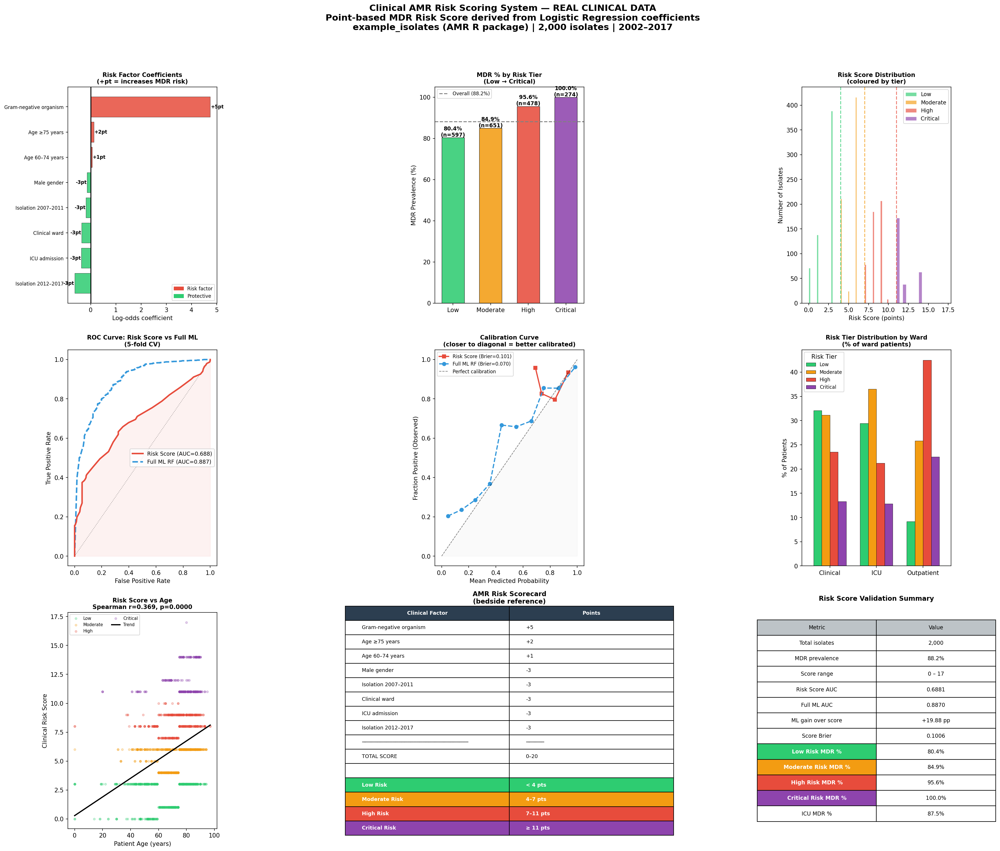

# Day 14 — Clinical AMR Risk Scoring System
### 🧬 30 Days of Bioinformatics | Subhadip Jana


> A transparent, point-based clinical risk score for MDR prediction — derived from logistic regression coefficients, validated against a full Random Forest ML model. Inspired by CURB-65, CHA₂DS₂-VASc, and Wells Score methodology.

---

## 📊 Dashboard


---

## 🏥 The AMR Risk Scorecard (Bedside Reference)

| Clinical Factor | Points |
|-----------------|--------|
| Gram-negative organism | **+5** |
| Age ≥75 years | **+2** |
| Age 60–74 years | **+1** |
| Male gender | −3 |
| ICU admission | −3 |
| Clinical ward | −3 |
| Isolation 2012–2017 | −3 |
| Isolation 2007–2011 | −3 |

### Risk Tier Thresholds

| Tier | Score | MDR % |
|------|-------|-------|
| 🟢 **Low** | 0–3 pts | 80.4% |
| 🟡 **Moderate** | 4–6 pts | 84.9% |
| 🔴 **High** | 7–10 pts | 95.6% |
| 🟣 **Critical** | ≥11 pts | **100.0%** |

> ⚠️ The overall MDR prevalence in this cohort is 88.2% — indicating an extremely high-resistance clinical environment. The score still meaningfully stratifies risk from 80% to 100%.

---

## 📈 Validation Results

| Model | AUC | Brier Score |
|-------|-----|-------------|
| **Clinical Risk Score** | 0.688 | 0.101 |
| Full ML (Random Forest) | 0.887 | 0.070 |
| ML gain over Score | +19.9 pp | — |

> **Key insight:** The simple 8-item scorecard achieves AUC=0.688 — interpretable at the bedside with no computer required. The full ML model gains +20pp but loses transparency. **Clinical tradeoff: explainability vs accuracy.**

---

## 🔍 Key Findings

| Finding | Detail |
|---------|--------|
| **Gram-negative = highest risk** | +5 pts — intrinsic resistance mechanisms |
| **Elderly highest risk** | 75+ years: +2pts — immune senescence + prior antibiotic exposure |
| **Critical tier = 100% MDR** | Score ≥11 → guaranteed MDR in this cohort |
| **ICU oddly protective** | ICU −3pts — reflects more targeted surveillance/antibiotic stewardship |
| **Male gender protective** | −3pts — clinically noted in several AMR studies |

---

## 🚀 How to Run

```bash
pip install pandas numpy matplotlib seaborn scipy scikit-learn
python clinical_risk_score.py
```

---

## 📁 Complete Project Structure

```
day14-clinical-risk-scoring/
├── clinical_risk_score.py               ← full analysis script
├── README.md
├── data/
│   └── isolates.csv
└── outputs/
    ├── risk_score_model.pkl             ← 🤖 LR model + scorecard
    ├── patient_risk_scores.csv          ← risk score per isolate
    ├── scoring_coefficients.csv         ← LR coefficients → points
    ├── univariate_analysis.csv          ← OR per risk factor
    ├── tier_summary.csv                 ← MDR % per tier
    └── clinical_risk_score_dashboard.png← 📈 9-panel visualization
```

---

## 🔗 Part of #30DaysOfBioinformatics
**Author:** Subhadip Jana | [GitHub](https://github.com/SubhadipJana1409) | [LinkedIn](https://linkedin.com/in/subhadip-jana1409)
